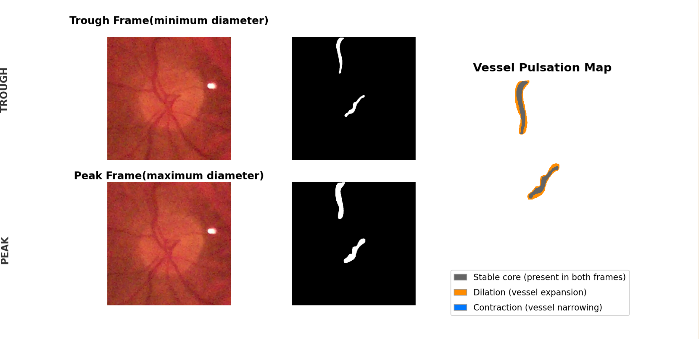
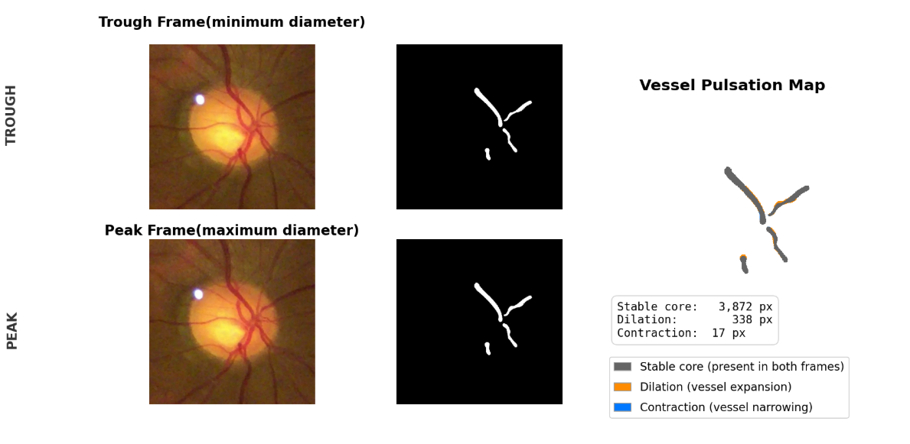
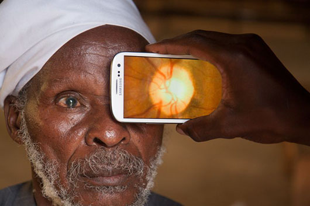
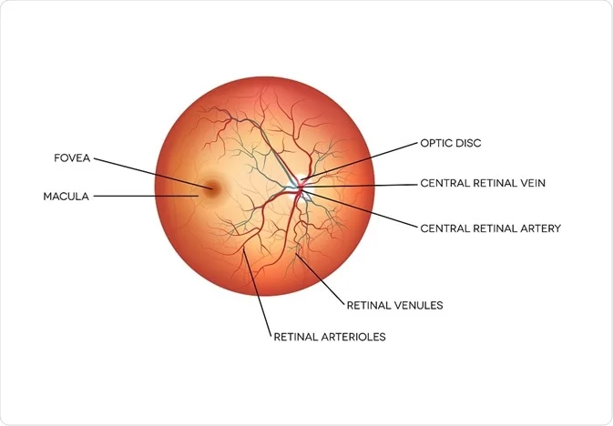

# Central Retinal Vessel Segmentation for Spontaneous Venous Pulsations (SVP) Analysis

## Computer Vision for Early Screening of Eye and Brain Disease

According to the Centers for Disease Control and Prevention (CDC), approximately 80 million people worldwide are currently living with glaucoma, a number projected to exceed 111 million by 2040. Elevated intracranial pressure (ICP) is also a life-threatening condition associated with traumatic brain injury, stroke, hemorrhage, and neurological damage.

A clinically significant indicator associated with both glaucoma and elevated ICP is the **absence of Spontaneous Venous Pulsations (SVP)**.

Spontaneous Venous Pulsation refers to the rhythmic narrowing and widening of the central retinal vein as it crosses the optic disc. These pulsations are synchronized with the heartbeat and reflect pressure changes between the eye and brain. When pulsations are absent, it may indicate abnormal pressure dynamics requiring further evaluation.

This project focuses on automated segmentation of retinal vessels near the optic disc to support objective SVP detection and early screening.

---

# Why This Matters

The retina is the only place in the body where blood vessels can be directly viewed non-invasively. Because retinal vessels respond to pressure changes, the eye can act as a **window to the brain**.

### Conditions Linked to Absent SVP

## Glaucoma
- Damages the optic nerve  
- Leading cause of irreversible blindness  
- Often progresses silently  

## Elevated Intracranial Pressure (ICP)
- Can occur after traumatic brain injury  
- May lead to seizures, stroke, or brain herniation  
- Requires urgent medical attention  

Restricted blood flow and abnormal pressure gradients may eliminate normal venous pulsation.

---

# Retinal Image Preprocessing

Retinal vessels are most visible in the **green channel** because hemoglobin strongly absorbs green light, increasing vessel contrast.

To improve clarity, **CLAHE (Contrast Limited Adaptive Histogram Equalization)** is applied to enhance local contrast while limiting noise.

<table>
<tr>
<td align="center"> <b>Original Fundus Image</b></td>
<td align="center"> <b>Green Channel Extraction</b></td>
<td align="center"> <b>CLAHE Enhanced Image</b></td>
</tr>
</table>

---

# Methodology

## System Architecture

The segmentation model uses a **U-Net neural network**, widely used in biomedical imaging.

### Why U-Net?

- Designed for medical segmentation  
- Performs well with limited data  
- Preserves fine vessel details  
- Produces accurate pixel-level masks  
- Strong performance on thin structures like retinal vessels  

---

### Pipeline Steps

1. Capture retinal video or frame sequence  
2. Detect:
   - **Peak frame** = maximum dilation  
   - **Trough frame** = minimum diameter  
3. Preprocess image  
4. Segment target vessel  
5. Compare vessel size changes  
6. Detect normal or abnormal SVP  

---

# Peak vs Trough Vessel Analysis

SVP is measured by comparing vessel diameter between two states.

<table>
<tr>
<td align="center"> <b>Peak (Maximum Diameter)</b></td>
</tr>
</table>

A healthy vessel should visibly expand and contract.

---

# Quantification

Instead of relying only on human observation, this system measures pulsation numerically.

<table>
<tr>
<td align="center"> <b>Pixel-Level Vessel Change Measurement</b></td>
</tr>
</table>

### Benefits

- Objective measurement  
- Tracks disease progression  
- Detects subtle abnormalities  
- Reduces missed cases  

---

# Performance Comparison

The model is evaluated based on whether SVP is correctly detected.

<table>
<tr>
<td align="center"> <b>SVP Detection Results</b></td>
</tr>
</table>

Key priority of this system: **minimize false negatives** (missing abnormal absence of SVP).

---

# Use Case Scenario

## Primary Care or Remote Screening

1. Patient visits clinic, ER, or mobile screening center  
2. Retinal video captured using fundus camera  
3. AI analyzes vessel pulsation automatically  
4. If abnormal SVP is detected, case is flagged  
5. Physician performs further glaucoma or ICP evaluation  

### Why This Matters

This enables screening in areas with:

- Limited ophthalmology access  
- Rural communities  
- Emergency departments  
- Low-cost telemedicine settings  

---

# Clinical Significance

This project is designed as an **early warning support system**.

### Potential Impact

- Earlier glaucoma detection before vision loss  
- Faster recognition of elevated ICP  
- Supports physician decision-making  
- Standardizes screening quality  
- Expands access using portable devices

<table>
<tr>
<td align="center"> <b>Cell Phone Screening</b></td>
</tr>
</table>

Over **1 billion people worldwide lack access to eye care**, while smartphone ownership continues to rise.

---

# Current Limitations

- Requires clear optic disc visibility  
- Eye movement may reduce accuracy  
- Small training dataset (~635 recordings)  
- Clinical validation ongoing  
- Lighting and camera quality affect results

<table>
<tr>
<td align="center"> <b>Optic Disc</b></td>
</tr>
</table>

---

# Future Work

- Larger and more diverse datasets  
- Real-time retinal video analysis  
- Temporal deep learning models  
- Smartphone deployment  
- Integration into telehealth systems  

---

# Goal

To create an accessible AI-assisted tool that helps detect early warning signs of **eye disease** and **brain pressure abnormalities** through retinal imaging.
